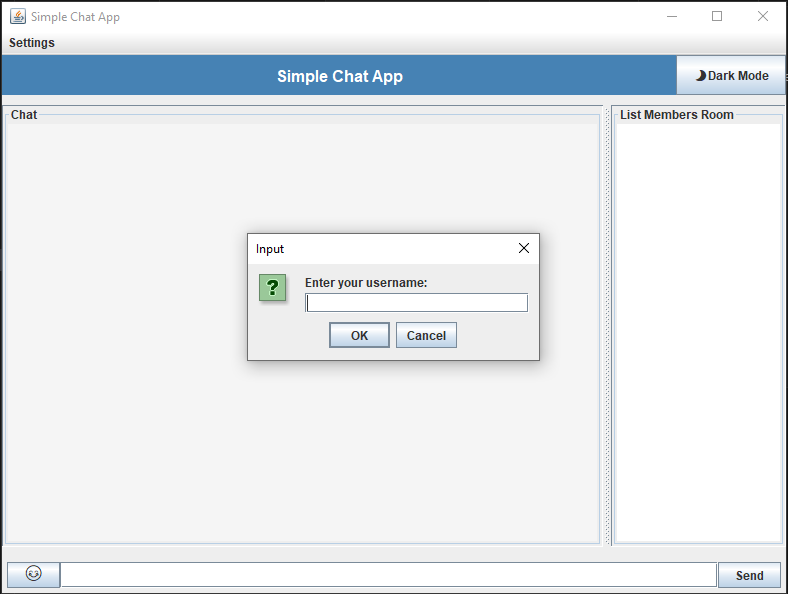
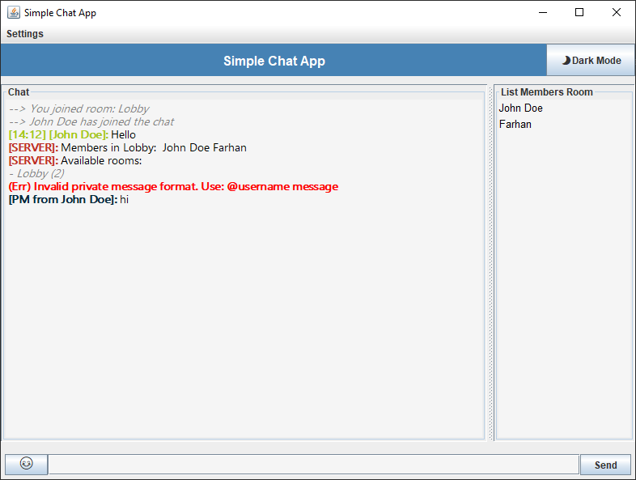

# Simple Chat App GUI

A simple Java Swing-based chat application with emoji picker, dark mode, and colored messages.

## Features

✅ Multi-client chat with server  
✅ Emoji picker with categorized tabs  
✅ Dark & light mode toggle  
✅ Colored usernames in chat  
✅ Error & system messages styled differently  
✅ Responsive, scrollable UI

## Requirements

- Java 8 or newer
- `json.jar` (for org.json)
- `emoji-java` library

## 📸 Screenshot



## Setup

### Libraries

Place these jar files in the `lib/` folder:
- `emoji-java-5.x.jar`
- `json-20250517.jar`

### Compile
Use the provided `.bat` file for Windows:

```
build.bat
```

```bash
javac -cp lib/*.jar -d build lib/EmojiPicker.java src/chat/client/ChatClient.java src/chat/server/ChatServer.java src/GUI/ClientUI.java
```

### Run

Use the provided `.bat` file for Windows:

Run Server

```
runServer.bat
```
Run Client

```
run.bat
```

or manually:

Server
```bash
java -cp build ChatServer
```

Client
```bash
java -cp "build;lib\emoji-java-5.1.1.jar;lib\json-20250517.jar" GUI.ClientUI
```

## Notes

- Username is requested on startup.
- Messages starting with `(Err)` appear in **red**.
- System messages (join/leave) appear in **gray italic**.
- Each user has a unique color.

---

Enjoy chatting! 🎉
